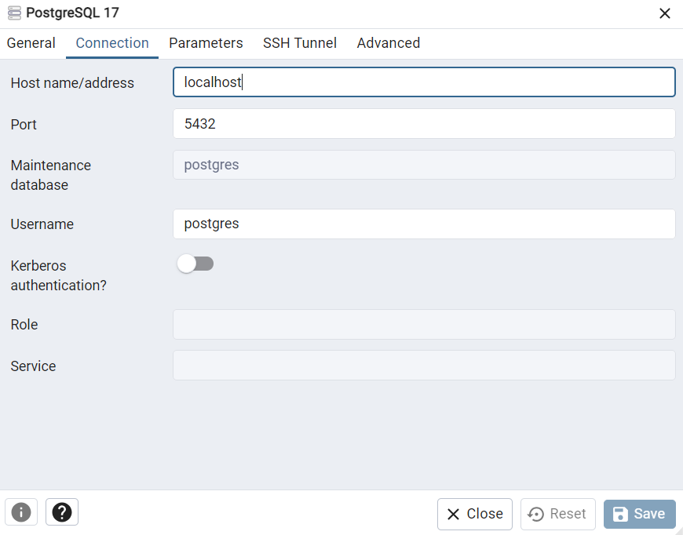
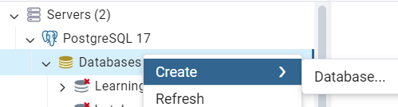
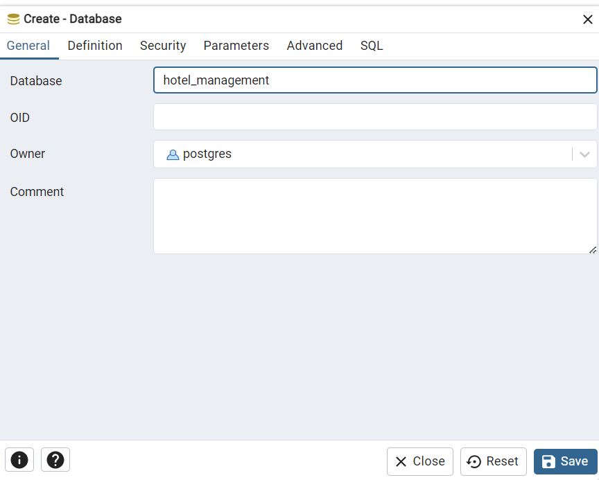
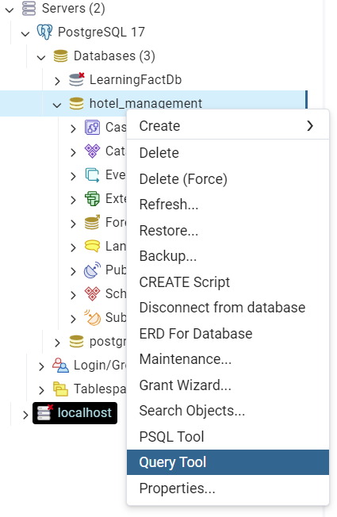
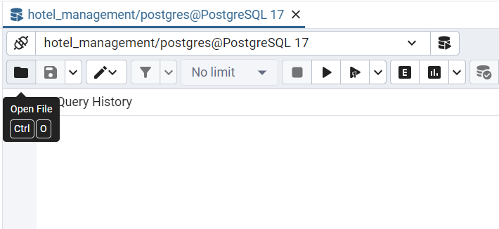
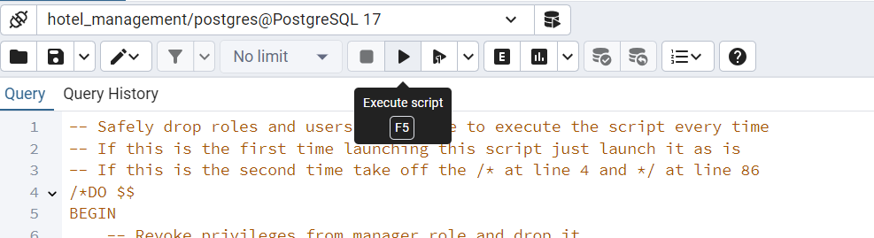
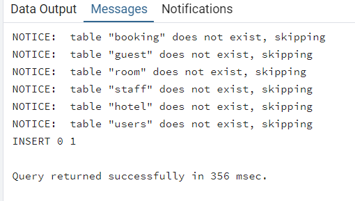

# ESILV Project

Start by cloning the project

Database installation :

1- Open pgAdmin

2- Click on Servers and connect to PostGreSQL 17

3- Right click on PostGreSQL 17 and click Properties. Make sure hostname/address is localhost and port is 5432

4- Right click on Databases select create and then database...

5- Name the database hotel_management and click save

6- Right click on your new database hotel_management and select Query Tool

7- Click on open file and open the file named setup that is in this project's folder

8- CLick on Execute script

9- Your output should look like this and the database is now setup. Don't close pgAdmin

Launching the project :

1- Install npm packages ("npm install" in frontend/backend/root)

2- Install Concurrently package in the root ("npm install concurrently --save-dev")

3- Type "npm start" in your cmd. It will launch the backend server and the frontend.

4- To connect, we have test logins : enter "admin_user" as username and "admin_password" as password.

5- You can explore the website via the frontpage (on http://localhost:4200). 